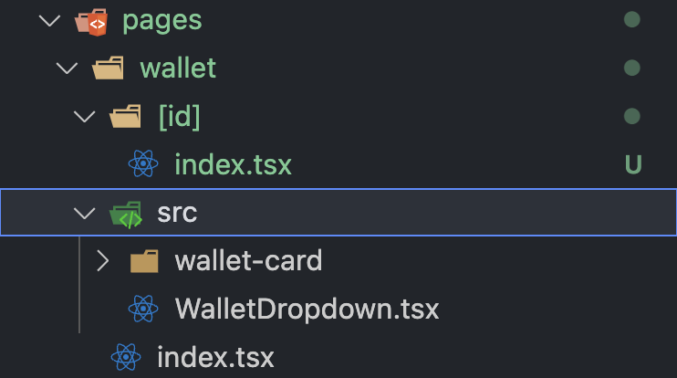

# Client-Folder-Structure Guide

`Next.js / Typescript / Recoil / React-Query / Styled-components`

install command

     yarn create next-app ./ --typescript
     yarn add recoil styled-components styled-reset @tanstack/react-query
     yarn add -D @tanstack/react-query-devtools

# Structure

    - public
    - pages
    - src
      - common
      - styles
      - hooks
      - utils
      - lib
      - constants
      - types
      - atoms
      - api
    

## 1. common

    - common
      - card
        - style.ts
        - type.ts
        - useCard.ts
        - index.tsx
      ...

### `common 폴더에는 UI와 UI 로직을 담은 hooks, Style, types만을 담았습니다.`

<br/>


흔히들 쓰는 components의 폴더입니다. 기존 components의 경우 어쩔수없이 종속적인 UI들이 있었는데요.

Card 라는 `component`에서 각자 다른 도메인들이 들어가서 계속 늘어나는 새로운 Card들을 어디에 둬야될지가 문제였습니다.


그렇다고 해당 도메인 페이지 폴더에 두자니 그건 그것대로 component 폴더가 ui와 도메인 종속적인 컴포넌트들을 분리해야될 것 같았습니다.

    그래서 pages의 src에는 도메인에 의존적인 컴포넌트들을 담고 common에서는 순수 UI를 담았습니다.

## 2. pages

    - pages
      - domain
        - index.tsx
        - [id] // 다이나믹 라우트 폴더 등등
        - src
          - component
            - UI
            - domain dependency hooks
            - types

`해당 도메인에 의존적인 컴포넌트들과 관련 모듈은 src에 담겨있고 페이지 로직은 index파일에서 처리합니다.`



```tsx
import { NextPage } from "next";
import WalletCard from "./src/wallet-card/WalletCard";
import Dropdown from "./src/WalletDropdown";

const Wallet: NextPage = () => {
	return (
		<div>
			<Dropdown />
			<WalletCard />
		</div>
	);
};

export default Wallet;
```

Next.js는 pages내에서 src라는 이름의 폴더는 라우팅하지 않기 때문에 이런 구조가 가능합니다.

SOLID 원칙 중 `개방-폐쇄 원칙(OCP: Open/closed principle)`에도 잘 맞는 구조입니다.

이제 우리는 Card의 원형은 수정하기 힘들지만 도메인에 종속된 WalletCard는 아무렇지 않게 수정할 수 있습니다. 또한 WalletCard를 수정한다고 하여 다른 유형들의 Card들이 영향받지 않고 각자 독립적으로 확장될 수 있습니다.

** nextjs 추가 설정 

```bash
Build error occurred
Error: Build optimization failed: found pages without a React Component as default export in
```

pages 폴더 내에서 다른 파일들과 같이 두려면 추가적으로 설정해줘야 될 것이 있습니다. 

```ts
module.exports = {
  pageExtensions: ['mdx', 'md', 'jsx', 'js', 'tsx', 'ts'],
}
```

next.config.js에서 해당 옵션을 추가하고 이제 모든 라우팅 파일에는 page라는 확장자를 추가로 붙여줘야 합니다.


https://nextjs.org/docs/api-reference/next.config.js/custom-page-extensions

## 3. styles

    - styles
      - theme.ts
      - globalStyle.ts
      - Mixin.ts

`styled-components`의 필요한 theme, 전역 스타일, Mixin 등

스타일 관련한 모듈들은 styles 폴더에서 관리합니다.

## 4. hooks

    - hooks
      - useInput.ts
      - useDebounce.ts
      - useNetwork.ts
      ...

공통으로 쓰이거나 재사용되는 `React hooks`는 hooks 폴더에 모아 관리합니다.

## 5. utils

    - utils
      - formatNumber.ts
      - formatText.ts
      ...

유틸적으로 사용되는 순수함수들은 utils폴더에 모아 관리합니다.

## 6. lib

    - lib
      - baseApi (axios)
      - i18n
      - caver
      - library dependency fn
      ...

라이브러리나 라이브러리에 의존하는 모듈들은 lib 폴더에서 관리합니다.

i18n 같은 경우 credential 등 관련 private key도 루트가 아닌 해당 모듈 폴더에서 관리하고 있습니다.

## 7. constants

    - constants
      - error-type.ts
      - regx.ts
      - contract-type.ts
      ...

상수로 관리되어야할 리터럴 객체나 문자열, 숫자 등은 constants 폴더에서 관리합니다.

## 8. types

    - types
      - wallet.ts
      - item.ts
      - product.ts
      - Pick.ts
      ...

해당 도메인의 `entity` 등 원형 단계에 속하는 type들 또는 재사용가능한 `커스텀 유틸리티 타입`들은 types 폴더에서 관리하고 있습니다.

## 9. atoms

    - atoms
      - auth.ts
      - balance.ts
      - cart
        - useCartState.ts
        - cart.ts
      ...

`Recoil` 전역 상태관리와 관련 selector 훅스 등은 atoms의 폴더에서 관리하고 있습니다.

## 10. api

    - api
      - common
        - response-type.ts
      - wallet
        - type.ts
        - wallet.ts
      - product
        - type.ts
        - product.ts
      ...

Fetching 라이브러리를 관리하고 있는 곳입니다. 해당 리소스 `Controller`별로 폴더가 파생되고 `response type`이나 `useQuery`을 정리해서 사용하고 있습니다.
