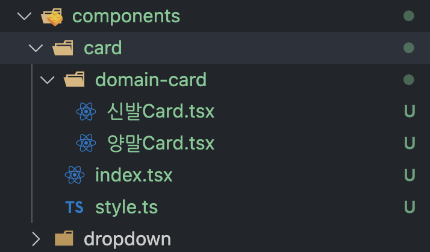
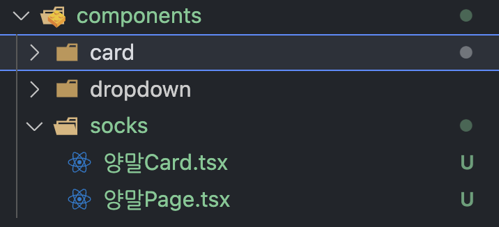
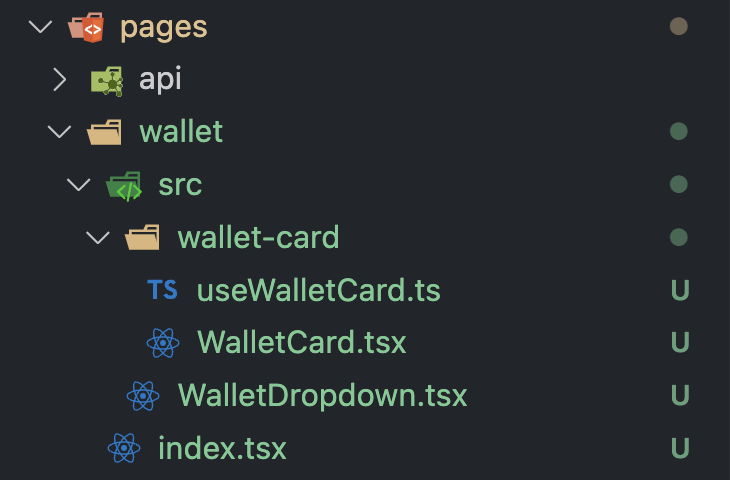

# Client-Folder-Structure Guide

install

     yarn create next-app ./ --typescript
     yarn add styled-components styled-reset @tanstack/react-query
     yarn add -D @tanstack/react-query-devtools

# Structure

    - common
    - pages
    - styles
    - hooks
    - utils
    - lib
    - constants
    - types
    - api
    - public

## 1. common

    - common
      - card
        - style.ts
        - useCard.ts
        - index.tsx
      ...

### `common 폴더에는 UI와 UI 로직을 담은 hooks, Style만을 담았습니다.`

<br/>



흔히들 쓰는 components의 폴더입니다. 기존 components의 경우 어쩔수없이 종속적인 UI들이 있었는데요.

Card 라는 `component`에서 각자 다른 도메인들이 들어가서 계속 늘어나는 새로운 Card들을 어디에 둬야될지가 문제였습니다.



그렇다고 해당 도메인 페이지 폴더에 두자니 그건 그것대로 component 폴더가 ui와 도메인 종속적인 컴포넌트들을 분리해야될 것 같았습니다.

    그래서 pages의 src에는 도메인에 의존적인 컴포넌트들을 담고 common에서는 순수 UI를 담았습니다.

## 2. pages

    - pages
      - domain
        - index.tsx
        - src
          - component
            - UI
            - domain dependency hooks

`해당 도메인에 의존적인 컴포넌트들과 관련 모듈은 src에 담겨있고 페이지 로직은 index파일에서 처리합니다.`



```tsx
import { NextPage } from "next";
import WalletCard from "./src/wallet-card/WalletCard";
import Dropdown from "./src/WalletDropdown";

const Wallet: NextPage = () => {
	return (
		<div>
			<Dropdown />
			<WalletCard />
		</div>
	);
};

export default Wallet;
```
